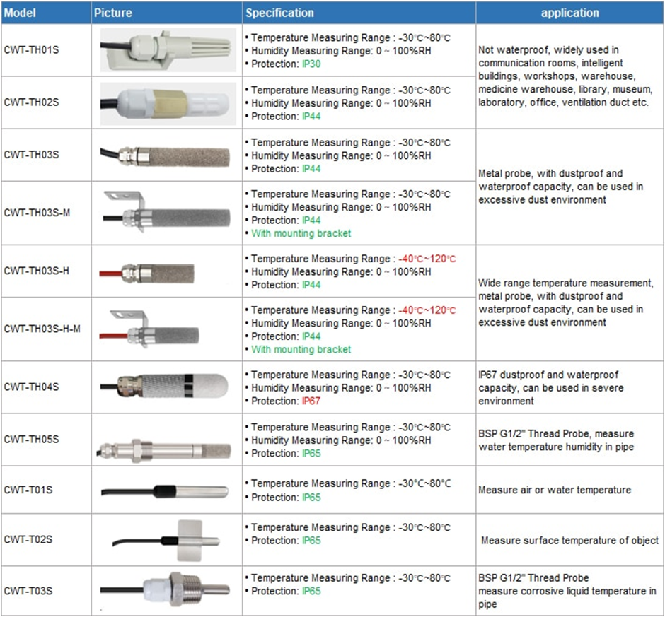
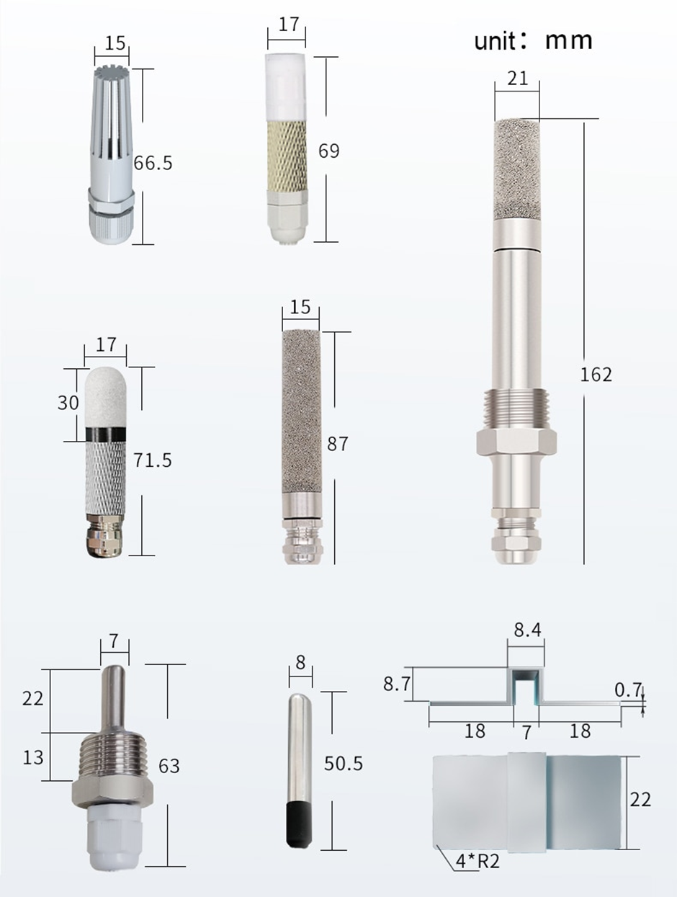

<!-- TOC -->
  * [Specification](#specification)
  * [Images](#images)
  * [Cable](#cable)
* [Defaults](#defaults)
* [Registers](#registers)
  * [Status](#status)
  * [Parameters](#parameters)
  * [Operations](#operations)
    * [Temp read](#temp-read)
    * [Slave Id](#slave-id)
    * [Baud rate](#baud-rate)
    * [Find slave ID](#find-slave-id)
  * [Home Assistant integration](#home-assistant-integration)
    * [CWT-T02S](#cwt-t02s)
<!-- TOC -->

## Specification

* Мощность: DC5V ~ DC24V
* Диапазон измерения температуры: -30 ℃ ~ 80 ℃
* Диапазон измерения влажности: 0 ~ 100% RH
* Точность измерения:
* Температура: ± 0,5 ℃ (Разрешение дисплея: 0,1 ℃) /влажности: ± 5% rh (Разрешение дисплея: 0,1 rh)
* Выход: RS485 (протокол MODBUS RTU)
* Потребление <0,1 Вт
* Расстояние связи RS485: до 800 м
* По умолчанию длина кабеля: 0,5 м 

## Images 



## Cable


| Color          | Function         |
|----------------|------------------|
| Brown          | Power+ (DC5-30V) |
| Black          | Power-           |
| Yellow (Green) | RS485 A+         |
| Blue           | RS485 B-         |

# Defaults

* 4800,n,8,1
* Slave# 1
* Modbus RTU

# Registers
## Status
| Register | PLC Address | Operation   | Bytes | unit    | Access |
|----------|-------------|-------------|-------|---------|--------|
| 0x0000   | 40001       | humidity    | 2     | 0.1 %rh | R      |
| 0x0001   | 40002       | temperature | 2     | 0.1 C   | R      |


## Parameters 

Read function 0x30, Write function 0x60

| Register | PLC Address | Operation            | Bytes | Values                  | Access |
|----------|-------------|----------------------|-------|-------------------------|--------|
| 0x07D0   | 42001       | Slave ID             | 2     | 1..254                  | R/W    |
| 0x07D1   | 42002       | Baud rate            | 2     | 0:2400, 1:4800, 2: 9600 | R/W    |
| 0x0050   | 42081       | Temp calibration     | 2     | 0.1 C                   | R/W    |
| 0x0051   | 42082       | Humidity Calibration | 2     | 0.1 %rh                 | R/W    |

## Operations
### Temp read

Request:
 ```
 Address: 0x01
 Function: 0x03
 Start Address: 0x0000
 Number of Points: 0x0002
 Error Check: 0xC40B
 ```
Response:
```
 Address: 0x01
 Function: 0x04
 Bytes: 0x04
 Humidity: 0x01E6
 Temperature: 0xFF9F
 Erro Check: 0x1BA0
```
Расчет температуры:
Когда температура меньше 0, значение будет отвечено в дополнение
Температура: FF9F H = -97 => Температура =-9,7 ℃
Влажность: 1E6 H = 486 => Влажность = 48.6%

### Slave Id

Request: 
```
 Address: 0x01
 Function: 0x06
 Start Address: 0x07D0
 ID: 0x0002
 Error Check: 0x0886 
```
Response:
```
 Address: 0x01
 Function: 0x06
 Start Address: 0x07D0
 ID: 0x0002
 Error Check: 0x0886 
```
### Baud rate

Request: 
```
 Address: 0x01
 Function: 0x06
 Start Address: 0x07D1
 ID: 0x0002
 Error Check: 0x5946 
```
Response:
```
 Address: 0x01
 Function: 0x06
 Start Address: 0x07D1
 ID: 0x0002
 Error Check: 0x5946 
```

### Find slave ID
Request: 
```
 Address: 0xFF
 Function: 0x03
 Start Address: 0x07D0
 Nuumber of points: 0x0001
 Error Check: 0x9159 
```
Response:
```
 Address: 0xFF
 Function: 0x03
 Start Address: 0x07D0
 Number of points: 0x02
 Address: 0x0001
 Error Check: 0x5050
```

## Home Assistant integration
### CWT-T02S
```

  - name: "hvac_zone_1_temp"
    address: 1
    slave: 2
    data_type: int16
    input_type: input
    unit_of_measurement: c
    scale: 0.1
    precision: 2
    scan_interval: 10
```

## CLI example

[pymodbus.console](https://pymodbus.readthedocs.io/en/latest/source/library/REPL.html)

Read temp
``` 
 >  client.read_holding_registers address=1 count=1 slave=2 unit=2
 
  {
    "registers": [
        306
    ]
}
```

Temp is 30.6